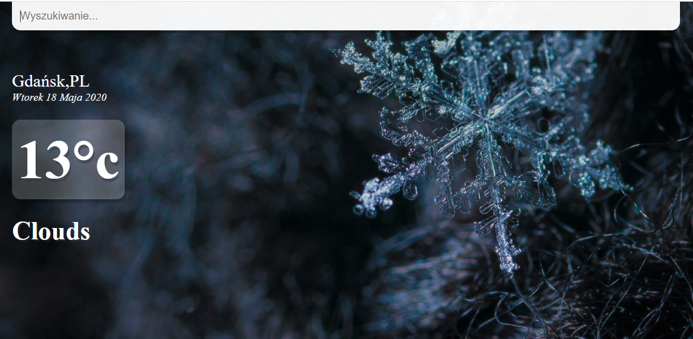
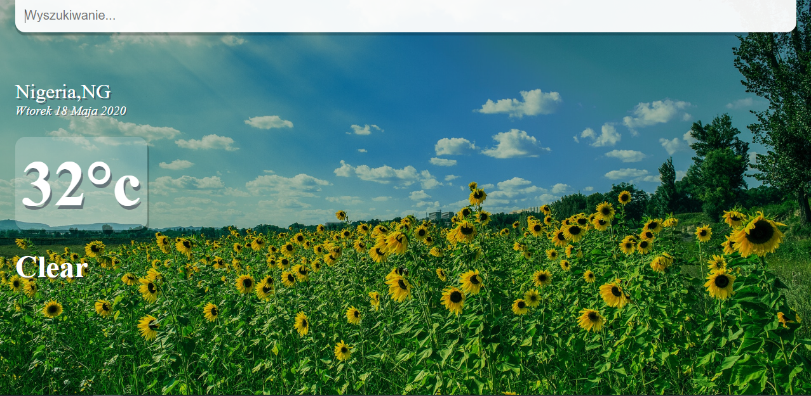

#React-Pogoda app

# React weather app

## Table of contents
* [General info](#general-info)
* [Setup](#setup)

## General info
Simple react weather app, created in Node.js  
###### Website appearance:

<h6> You can choose the city of your interest:</h6>

## Setup
To run this project, download it and type: `npm install` and next: `npm start` in main folder of project.
